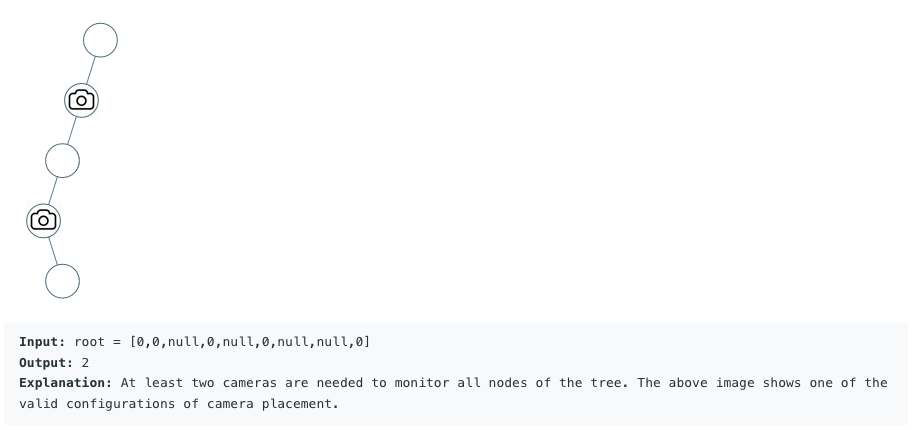

## Binary Tree Cameras

Challenge is available at: https://leetcode.com/problems/binary-tree-cameras/

You are given the root of a binary tree. We install cameras on the tree nodes where each camera at a node can monitor its parent, itself, and its immediate children.

Return the minimum number of cameras needed to monitor all nodes of the tree.

**Examples:**  

**Constraints**:  

- The number of nodes in the tree is in the range [1, 1000].
- Node.val == 0

**Guidelines**:
- Put all code in Camera class so that it can be verified at the source site. 
- TreeNode class is provided, you do not need to include it in your code
- It is mandatory to use TreeNode
