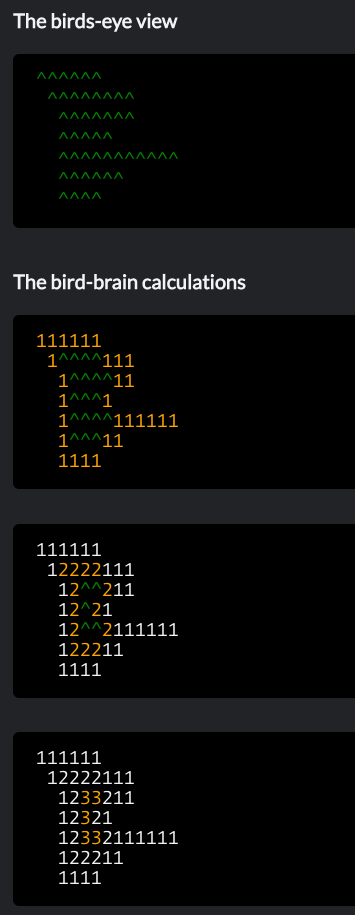

## Bird Mountain

Challenge is available at: https://www.codewars.com/kata/5c09ccc9b48e912946000157

A bird flying high above a mountain range is able to estimate the height of the highest peak.

_Height = 3_

Write a Java program that implements the above logic and calculates the height for any input.

Guidelines:
- Put all code in _BirdMountain_ class so that it can be verified at the source site.

## Bird Mountain - River

Challenge is available at: https://www.codewars.com/kata/bird-mountain-the-river

This time our protagonist bird also sees a RIVER.
The bird quickly calculates how much ground will remain dry as the water rises.

_Dry ground = [189, 99, 19, 3]_

Notes:
- The ground is always supplied as a rectangular grid
- The normal river is at level -0.5. It is rising at 1 unit per day
- Sometimes there isn't any river at all, so you better account for those cases too!

Write a Java program that counts how many dry landing spots there are for the next 3 days only (include day 0)

Guidelines:
- Put all code in BirdMountainRiver class so that it can be verified at the source site.  
